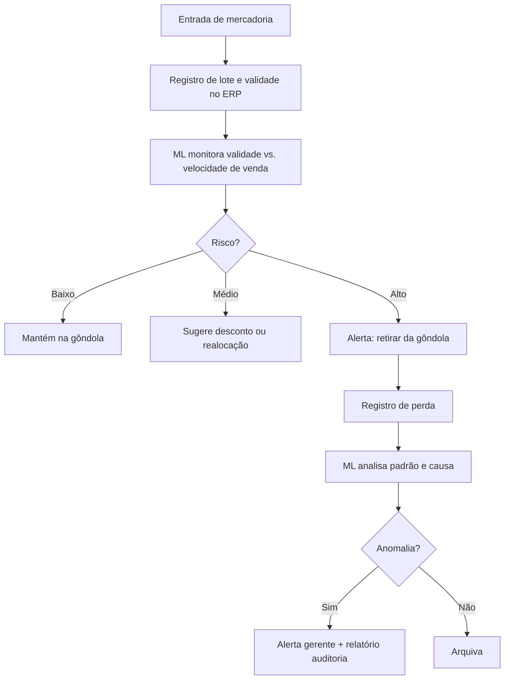
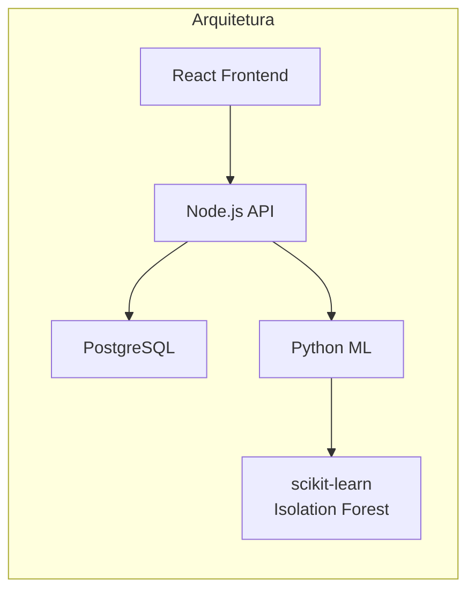
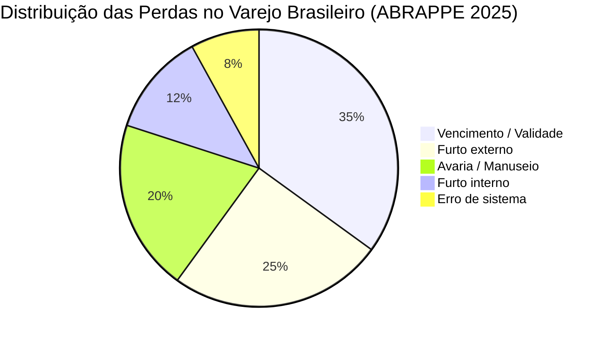

# MVP — Controle de Validade e Prevenção de Perdas com IA (Atacadão)

**UC11:** Gerir Projetos de Tecnologia da Informação  
**Equipe:** William, Alaide, Ed

---

## Visão Geral

MVP de um sistema de inteligência artificial para controle de validade, prevenção de perdas e detecção de anomalias na rede Atacadão. Acoplado ao ERP existente (TOTVS Consinco/RMS), o sistema monitora em tempo real o risco de vencimento, sugere ações preventivas e identifica padrões suspeitos de perda.

---

## 1. Controle de Validade e Prevenção de Perdas

### Sistema Atual (Real)
- MPDFT firmou **TAC nº 851/2023** com o Atacadão Dia a Dia após fiscalização encontrar **113 produtos vencidos** em uma única loja em Samambaia/DF (fonte: MPDFT)
- Em março de 2026, MP-BA investiga denúncias de venda de carnes impróprias em Salvador, com relatos de:
  - Substituição de carnes escolhidas por produtos de menor qualidade ou vencidos
  - Moagem de carnes fora do prazo de validade para vendê-las como novas
  - Recongelamento de carnes totalmente descongeladas (fonte: BNews)
- Perdas no varejo brasileiro totalizaram **R$ 42,1 bilhões em 2025**, alta de 15,3% em relação ao ano anterior, o que representa **1,65% do faturamento** do setor (fonte: ABRAPPE)
- Atacadão possui controle de lote e validade no ERP, mas falhas na execução geram riscos sanitários, multas e danos à reputação
- Maior parte das perdas só é detectada no inventário físico, que ocorre mensalmente

### Sistema com IA (MVP)

#### 1.1 Monitoramento Preditivo de Validade
- IA cruza data de vencimento de cada lote com a velocidade média de venda do produto na filial
- Calcula diariamente a **probabilidade de vencimento antes da venda** para cada lote
- Classifica em 3 níveis:
  - **Verde** (sem risco) — venda projetada muito antes do vencimento
  - **Amarelo** (atenção) — produto pode vencer se a venda não acelerar
  - **Vermelho** (crítico) — venda projetada após o vencimento, ação necessária

#### 1.2 Sugestão Automática de Ações
- **Desconto dinâmico:** sugere valor de desconto automaticamente para produtos em amarelo/vermelho (ex: 20% off para acelerar saída)
- **Realocação entre filiais:** identifica filiais com alta demanda e sugere transferência: *"Loja A vende 50 unidades/dia, Loja B vende 5 — transferir 30 unidades para Loja A"*
- **Descarte programado:** para produtos críticos sem chance de venda, gera alerta para retirar da gôndola e registrar baixa para descarte

#### 1.3 Dashboard de Risco de Perda
- Heatmap por filial, categoria e fornecedor
- Ranking de produtos com maior risco de perda no mês
- Alerta push para o gerente quando um lote entra em estado crítico

---

## 2. Detecção de Anomalias em Perdas e Fraudes

### Sistema Atual (Real)
- Perdas no varejo brasileiro: R$ 42,1 bilhões em 2025 (ABRAPPE)
- Atacarejo é o formato mais eficiente do setor, mas ainda sofre com perdas operacionais e furtos
- Investigações recentes mostram fragilidades:
  - MPDFT identificou falha sistêmica no controle de validade (TAC vigente desde 2023)
  - MP-BA investiga práticas fraudulentas intencionais em loja de Salvador (2026)
- Atualmente, perdas são registradas manualmente pelo estoquista sem cruzamento inteligente de dados
- Fraude só é descoberta quando o cliente denuncia ou na auditoria periódica

### Sistema com IA (MVP)

#### 2.1 Monitoramento Contínuo de Padrões
- ML analisa todos os registros de perda (vencimento, avaria, extravio) cruzando com:
  - Filial, turno, operador responsável, categoria do produto, dia da semana
  - Histórico de vendas da filial
  - Estoque recebido vs. vendido vs. perdido

#### 2.2 Detecção de Anomalias
- **Desvio entre filiais:** *"Loja X registra 3x mais perda por avaria em eletrônicos que a média da rede"*
- **Desvio por turno/operador:** *"Perdas no turno da noite são 80% maiores que no turno da manhã"*
- **Padrão suspeito:** *"Produto Y teve 10 registros de extravio no mesmo mês — provável furto"*
- **Quebra de padrão:** aumento súbito de perda em categoria que historicamente tinha baixa perda

#### 2.3 Classificação por Causa Provável
- IA classifica automaticamente cada perda em:
  - **Vencimento** — falha no giro de estoque (PVPS)
  - **Manuseio** — avaria durante transporte ou estocagem
  - **Furto** — padrão compatível com subtração (extravio sem registro de venda)
  - **Erro de sistema** — divergência entre estoque físico e contábil
- Relatório mensal por causa, permitindo ação direcionada da gestão

#### 2.4 Alertas em Tempo Real
- Gerente recebe notificação automática quando anomalia é detectada
- Sugestão de ação: *"Investigar Loja X, corredor 3, turno noturno — perda 3x acima da média"*
- Histórico para auditoria e prestação de contas ao MP (quando aplicável)

---

## Fluxo do MVP

---

## Distribuição das Perdas no Varejo (Referência)

---

## Critérios de Sucesso

| Indicador | Meta | Referência Setorial |
|-----------|------|---------------------|
| Redução de produtos vencidos em loja | Zero | TAC MPDFT vigente |
| Redução de perdas totais | 15% | Perdas no varejo: R$ 42,1 bi / 1,65% faturamento (ABRAPPE 2025) |
| Tempo entre perda e detecção | Redução de 70% | Hoje: detectado apenas no inventário mensal |
| Precisão da classificação de causa | > 85% | — |
| Alertas de anomalia com taxa de falsos positivos | < 10% | — |

---

## Tecnologias

| Camada | Tecnologia | Por quê? |
|--------|-----------|----------|
| Frontend | React + TypeScript | Ecossistema maduro, componentes reutilizáveis, tipagem estática para evitar erros em tela |
| Backend | Node.js (API) + Python (ML) | Node.js para API REST rápida e eficiente; Python para ML porque tem o ecossistema mais robusto (scikit-learn, pandas, numpy) |
| Banco de Dados | PostgreSQL | Relacional, suporta consultas complexas, dados estruturados de estoque e vendas, amplamente usado no varejo |
| ML | scikit-learn, pandas, numpy (Isolation Forest para anomalias) | Isolation Forest é eficaz para detecção de anomalias em dados de alta dimensão, bibliotecas leves e bem documentadas |
| Vizualização | Chart.js / Recharts (dashboard) | Leves, integram bem com React, suportam gráficos interativos em tempo real |
| Notificação | WebSocket / Push | Alerta em tempo real para o gerente sem necessidade de recarregar página |

---

## Fontes

- [Estadão — Carrefour admite desabastecimento de carnes em lojas do Atacadão (nov/2024)](https://www.estadao.com.br/economia/agronegocios/carrefour-desabastecimento-carnes-atacadao/)
- [MPDFT — TAC nº 851/2023 com Atacadão Dia a Dia (atualizado jun/2026)](https://www.gamalivre.com.br/2026/06/mpdft-atualiza-tac-com-rede-de.html)
- [BNews — Atacadão investigado por carnes impróprias em Salvador (mar/2026)](https://www.bnews.com.br/noticias/salvador/atacadao-e-investigado-pelo-mp-apos-denuncias-de-venda-de-carnes-improprias-em-salvador.html)
- [ABRAPPE — 9ª Pesquisa de Prevenção de Perdas no Varejo Brasileiro (2025)](https://samais.com.br/publicacoes/perdas-de-r-421-bilhoes-se-o-desperdicio-fosse-uma-empresa-seria-a-4a-maior-do-varejo-alimentar-brasileiro)
- [Neogrid — Índice de Ruptura (mai/2026)](https://www.cnnbrasil.com.br/agro/ovos-e-cafe-impulsionam-indice-de-ruptura-em-supermercados-em-maio/)
- [Diário do Comércio — Atacadão acelera transformação digital (2025)](https://dcomercio.com.br/publicacao/s/atacadao-acelera-transformacao-digital-de-olho-na-experiencia-do-cliente)
- [Blog Atacadão — Cuidar do Estoque é Fundamental (2021)](https://blog.atacadao.com.br/gestao/cuidar-do-estoque-e-fundamental/)
