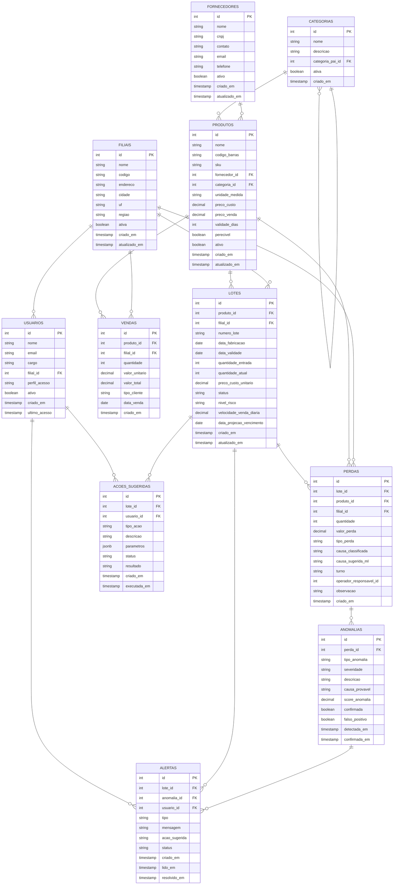
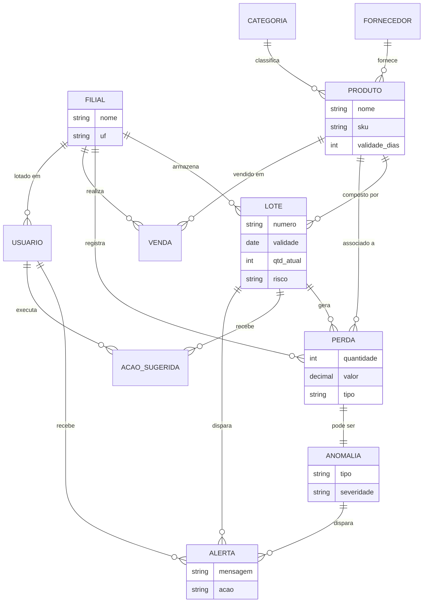

# Modelo Entidade-Relacionamento (ER)

**UC11:** Gerir Projetos de Tecnologia da Informação  
**Equipe:** William, Alaide, Ed  
**SGBD:** PostgreSQL 16

---

## Diagrama ER Completo

---

## Diagrama Conceitual (Simplificado)

---

## Principais Relacionamentos

| Entidade A | Relacionamento | Entidade B | Significado |
|-----------|---------------|-----------|-------------|
| Filial | 1 → N | Lote | Uma filial possui vários lotes em estoque |
| Produto | 1 → N | Lote | Um produto pode ter vários lotes (diferentes datas) |
| Fornecedor | 1 → N | Produto | Um fornecedor fornece vários produtos |
| Categoria | 1 → N | Produto | Uma categoria agrupa vários produtos |
| Categoria | 1 → N | Categoria | Auto-relacionamento (subcategorias) |
| Lote | 1 → N | Perda | Um lote pode gerar várias perdas |
| Lote | 1 → N | Ação Sugerida | Um lote pode ter várias ações sugeridas |
| Perda | 1 → N | Anomalia | Uma perda pode gerar uma ou mais anomalias |
| Anomalia | 1 → N | Alerta | Uma anomalia dispara alertas para usuários |
| Lote | 1 → N | Alerta | Um lote em risco dispara alertas |
| Usuário | 1 → N | Alerta | Um usuário recebe vários alertas |
| Usuário | 1 → N | Ação Sugerida | Um usuário executa várias ações |
| Filial | 1 → N | Venda | Uma filial realiza várias vendas |
| Filial | 1 → N | Usuário | Uma filial tem vários usuários lotados |

---

## Regras de Negócio (Banco de Dados)

1. **Unicidade de lote por filial:** Um mesmo número de lote do fornecedor pode existir em múltiplas filiais (combinação `numero_lote + filial_id` não é única), mas cada registro de lote é único por `(produto_id, filial_id, numero_lote)`.
2. **Consistência de risco:** O `nivel_risco` do lote é calculado automaticamente pelo ML e atualizado diariamente ou sob demanda.
3. **Auditoria de perdas:** Toda perda registrada deve ter `lote_id` preenchido para rastreabilidade.
4. **Anomalia × falso positivo:** Uma anomalia marcada como `falso_positivo = true` deve ter `confirmada = true` também.
5. **Alertas ativos:** Alertas com `status = 'pendente'` são os únicos considerados para notificação em tempo real.
6. **Integridade referencial:** Todas as chaves estrangeiras possuem `ON DELETE RESTRICT` para evitar exclusão acidental de dados históricos.
