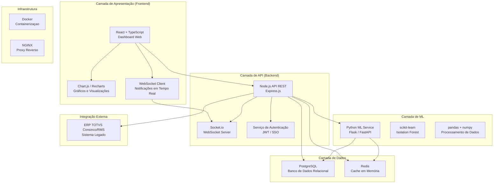
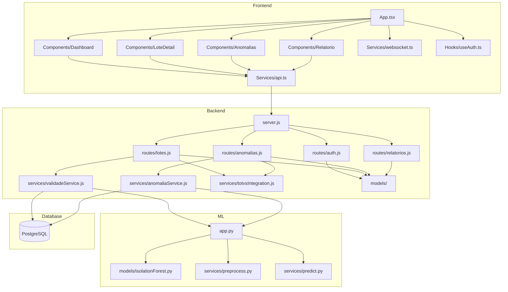

# Arquitetura do Sistema — MVP Controle de Validade e Prevenção de Perdas

**UC11:** Gerir Projetos de Tecnologia da Informação  
**Equipe:** William, Alaide, Ed

---

## Visão Geral da Arquitetura



---

## Diagrama de Componentes



---

## Fluxo de Dados

### 1. Monitoramento de Validade

```
TOTVS ERP
   │ (Webhook / Job Agendado)
   ▼
Node.js API ──► PostgreSQL (armazena lote)
   │
   ├──► Python ML (calcula risco)
   │       │
   │       └──► PostgreSQL (atualiza risco)
   │
   └──► WebSocket (notifica dashboard)
          │
          └──► React (exibe no frontend)
```

### 2. Detecção de Anomalias

```
PostgreSQL (dados de perda)
   │
   ▼
Python ML (Isolation Forest)
   │
   ├──► Normal → Arquiva
   │
   └──► Anomalia Detectada
          │
          ├──► PostgreSQL (registra anomalia)
          │
          └──► WebSocket (alerta gerente)
                 │
                 └──► React (notificação em tempo real)
```

### 3. Sugestão de Ação (Desconto / Realocação / Descarte)

```
Dashboard React
   │ (usuário clica em "Aplicar Ação")
   ▼
Node.js API
   │
   ├──► PostgreSQL (atualiza status do lote)
   │
   └──► TOTVS ERP (aplica desconto no PDV / gera transferência)
```

---

## Stack Tecnológica Detalhada

| Camada | Tecnologia | Versão | Função |
|--------|-----------|--------|--------|
| **Frontend** | React + TypeScript | 18.x | Interface web do dashboard |
| **Visualização** | Chart.js / Recharts | 4.x / 2.x | Gráficos do dashboard |
| **Estilização** | CSS Modules / Tailwind | 3.x | Estilização dos componentes |
| **Backend** | Node.js + Express | 20.x LTS | API REST principal |
| **WebSocket** | Socket.io | 4.x | Notificações em tempo real |
| **Autenticação** | JWT + Passport.js | — | Controle de acesso |
| **ML** | Python + Flask | 3.11 / 2.x | Serviço de machine learning |
| **ML Libs** | scikit-learn, pandas, numpy | 1.3.x | Algoritmos de detecção |
| **BD Relacional** | PostgreSQL | 16.x | Dados estruturados do sistema |
| **Cache** | Redis | 7.x | Cache de consultas frequentes |
| **Proxy** | NGINX | 1.24.x | Proxy reverso e SSL |
| **Container** | Docker + Docker Compose | 24.x | Ambiente padronizado |
| **Documentação API** | Swagger / OpenAPI 3.0 | — | Documentação dos endpoints |

---

## Decisões Arquiteturais

| Decisão | Opção Escolhida | Alternativa | Justificativa |
|---------|----------------|-------------|---------------|
| API Style | REST | GraphQL | Simplicidade, integração com TOTVS via REST, ecossistema maduro |
| ML Integration | Serviço separado (Python) | Node.js ML | Ecossistema Python é superior para ML (scikit-learn, pandas) |
| Realtime | WebSocket (Socket.io) | Polling | Baixa latência, notificações instantâneas |
| Cache | Redis | In-memory | Persistência, compartilhamento entre instâncias |
| Containerização | Docker | VM | Portabilidade, leveza, escalabilidade horizontal |
| Integração ERP | API REST | Webhook + Pull | TOTVS expõe APIs REST; webhook para eventos, pull para sincronia |

---

## Requisitos de Infraestrutura

| Recurso | Especificação | Justificativa |
|---------|--------------|---------------|
| Servidor Frontend | 2 vCPU, 4 GB RAM | Aplicação React estática servida via NGINX |
| Servidor Backend | 4 vCPU, 8 GB RAM | API Node.js + WebSocket + conexões simultâneas |
| Servidor ML | 4 vCPU, 16 GB RAM | Processamento de dados e inferência do modelo |
| Banco de Dados | 4 vCPU, 16 GB RAM, SSD NVMe | Consultas complexas, índices, crescimento de dados |
| Redis | 2 vCPU, 4 GB RAM | Cache de sessão e consultas frequentes |
| Armazenamento | 500 GB SSD | Logs, backups, exportações |
