# Banco de Dados — Definição e Modelagem

**UC11:** Gerir Projetos de Tecnologia da Informação  
**Equipe:** William, Alaide, Ed  
**SGBD:** PostgreSQL 16

---

## Visão Geral

Banco de dados relacional para armazenar dados de estoque, lotes, vendas, perdas e anomalias da rede Atacadão. Integrado ao ERP TOTVS Consinco/RMS.

---

## Diagrama Entidade-Relacionamento

```mermaid
erDiagram
    FILIAIS ||--o{ LOTES : possui
    FILIAIS ||--o{ VENDAS : registra
    FILIAIS ||--o{ PERDAS : registra
    FORNECEDORES ||--o{ PRODUTOS : fornece
    CATEGORIAS ||--o{ PRODUTOS : classifica
    PRODUTOS ||--o{ LOTES : tem
    PRODUTOS ||--o{ VENDAS : vendido_em
    PRODUTOS ||--o{ PERDAS : perdido_em
    LOTES ||--o{ PERDAS : origem
    LOTES ||--o{ ALERTAS : gera
    LOTES ||--o{ ACOES_SUGERIDAS : sugere
    USUARIOS ||--o{ ALERTAS : recebe
    USUARIOS ||--o{ ACOES_SUGERIDAS : executa
    PERDAS ||--o{ ANOMALIAS : detectada_em
    ANOMALIAS ||--o{ ALERTAS : gera

    FILIAIS {
        int id PK
        string nome
        string codigo
        string endereco
        string cidade
        string uf
        string regiao
        boolean ativa
        timestamp criado_em
        timestamp atualizado_em
    }

    FORNECEDORES {
        int id PK
        string nome
        string cnpj
        string contato
        string email
        string telefone
        boolean ativo
        timestamp criado_em
        timestamp atualizado_em
    }

    CATEGORIAS {
        int id PK
        string nome
        string descricao
        int categoria_pai_id FK
        boolean ativa
        timestamp criado_em
    }

    PRODUTOS {
        int id PK
        string nome
        string codigo_barras
        string sku
        int fornecedor_id FK
        int categoria_id FK
        string unidade_medida
        decimal preco_custo
        decimal preco_venda
        int validade_dias
        boolean perecivel
        boolean ativo
        timestamp criado_em
        timestamp atualizado_em
    }

    LOTES {
        int id PK
        int produto_id FK
        int filial_id FK
        string numero_lote
        date data_fabricacao
        date data_validade
        int quantidade_entrada
        int quantidade_atual
        decimal preco_custo_unitario
        string status
        string nivel_risco
        decimal velocidade_venda_diaria
        date data_projecao_vencimento
        timestamp criado_em
        timestamp atualizado_em
    }

    VENDAS {
        int id PK
        int produto_id FK
        int filial_id FK
        int quantidade
        decimal valor_unitario
        decimal valor_total
        string tipo_cliente
        date data_venda
        timestamp criado_em
    }

    PERDAS {
        int id PK
        int lote_id FK
        int produto_id FK
        int filial_id FK
        int quantidade
        decimal valor_perda
        string tipo_perda
        string causa_classificada
        string causa_sugerida_ml
        string turno
        int operador_responsavel_id
        string observacao
        timestamp criado_em
    }

    ANOMALIAS {
        int id PK
        int perda_id FK
        string tipo_anomalia
        string severidade
        string descricao
        string causa_provavel
        decimal score_anomalia
        boolean confirmada
        boolean falso_positivo
        timestamp detectada_em
        timestamp confirmada_em
    }

    ALERTAS {
        int id PK
        int lote_id FK
        int anomalia_id FK
        int usuario_id FK
        string tipo
        string mensagem
        string acao_sugerida
        string status
        timestamp criado_em
        timestamp lido_em
        timestamp resolvido_em
    }

    ACOES_SUGERIDAS {
        int id PK
        int lote_id FK
        int usuario_id FK
        string tipo_acao
        string descricao
        jsonb parametros
        string status
        string resultado
        timestamp criado_em
        timestamp executada_em
    }

    USUARIOS {
        int id PK
        string nome
        string email
        string cargo
        int filial_id FK
        string perfil_acesso
        boolean ativo
        timestamp criado_em
        timestamp ultimo_acesso
    }
```



---

## Dicionário de Dados

### filiais

| Coluna | Tipo | Restrição | Descrição |
|--------|------|-----------|-----------|
| id | SERIAL | PK | Identificador único da filial |
| nome | VARCHAR(100) | NOT NULL | Nome da filial |
| codigo | VARCHAR(20) | UNIQUE, NOT NULL | Código interno da filial |
| endereco | VARCHAR(255) | — | Endereço completo |
| cidade | VARCHAR(50) | NOT NULL | Cidade |
| uf | CHAR(2) | NOT NULL | Unidade federativa |
| regiao | VARCHAR(20) | — | Região geográfica (Norte, Sul, etc.) |
| ativa | BOOLEAN | DEFAULT true | Se a filial está ativa |
| criado_em | TIMESTAMP | DEFAULT NOW() | Data de criação do registro |
| atualizado_em | TIMESTAMP | DEFAULT NOW() | Data da última atualização |

### fornecedores

| Coluna | Tipo | Restrição | Descrição |
|--------|------|-----------|-----------|
| id | SERIAL | PK | Identificador único do fornecedor |
| nome | VARCHAR(100) | NOT NULL | Razão social |
| cnpj | VARCHAR(18) | UNIQUE, NOT NULL | CNPJ do fornecedor |
| contato | VARCHAR(100) | — | Nome do contato |
| email | VARCHAR(100) | — | Email do contato |
| telefone | VARCHAR(20) | — | Telefone do contato |
| ativo | BOOLEAN | DEFAULT true | Se o fornecedor está ativo |
| criado_em | TIMESTAMP | DEFAULT NOW() | Data de criação |
| atualizado_em | TIMESTAMP | DEFAULT NOW() | Data da última atualização |

### categorias

| Coluna | Tipo | Restrição | Descrição |
|--------|------|-----------|-----------|
| id | SERIAL | PK | Identificador único da categoria |
| nome | VARCHAR(50) | NOT NULL | Nome da categoria |
| descricao | TEXT | — | Descrição da categoria |
| categoria_pai_id | INTEGER | FK → categorias(id) | Categoria pai (auto-relacionamento) |
| ativa | BOOLEAN | DEFAULT true | Se a categoria está ativa |
| criado_em | TIMESTAMP | DEFAULT NOW() | Data de criação |

### produtos

| Coluna | Tipo | Restrição | Descrição |
|--------|------|-----------|-----------|
| id | SERIAL | PK | Identificador único do produto |
| nome | VARCHAR(150) | NOT NULL | Nome do produto |
| codigo_barras | VARCHAR(20) | UNIQUE | Código de barras (EAN) |
| sku | VARCHAR(20) | UNIQUE, NOT NULL | SKU do produto |
| fornecedor_id | INTEGER | FK → fornecedores(id) | Fornecedor do produto |
| categoria_id | INTEGER | FK → categorias(id) | Categoria do produto |
| unidade_medida | VARCHAR(10) | NOT NULL | Unidade (kg, un, l, cx) |
| preco_custo | DECIMAL(10,2) | NOT NULL | Preço de custo |
| preco_venda | DECIMAL(10,2) | NOT NULL | Preço de venda |
| validade_dias | INTEGER | — | Prazo de validade em dias |
| perecivel | BOOLEAN | DEFAULT false | Se é produto perecível |
| ativo | BOOLEAN | DEFAULT true | Se o produto está ativo |
| criado_em | TIMESTAMP | DEFAULT NOW() | Data de criação |
| atualizado_em | TIMESTAMP | DEFAULT NOW() | Data da última atualização |

### lotes

| Coluna | Tipo | Restrição | Descrição |
|--------|------|-----------|-----------|
| id | SERIAL | PK | Identificador único do lote |
| produto_id | INTEGER | FK → produtos(id) | Produto do lote |
| filial_id | INTEGER | FK → filiais(id) | Filial onde o lote está |
| numero_lote | VARCHAR(50) | NOT NULL | Número do lote (fornecedor) |
| data_fabricacao | DATE | NOT NULL | Data de fabricação |
| data_validade | DATE | NOT NULL | Data de validade |
| quantidade_entrada | INTEGER | NOT NULL | Quantidade recebida |
| quantidade_atual | INTEGER | NOT NULL | Quantidade atual em estoque |
| preco_custo_unitario | DECIMAL(10,2) | NOT NULL | Preço de custo unitário |
| status | VARCHAR(20) | DEFAULT 'ativo' | Status (ativo, descartado, vendido) |
| nivel_risco | VARCHAR(10) | — | Nível de risco (verde, amarelo, vermelho) |
| velocidade_venda_diaria | DECIMAL(10,2) | — | Média de venda por dia |
| data_projecao_vencimento | DATE | — | Data projetada de vencimento |
| criado_em | TIMESTAMP | DEFAULT NOW() | Data de criação |
| atualizado_em | TIMESTAMP | DEFAULT NOW() | Data da última atualização |

### vendas

| Coluna | Tipo | Restrição | Descrição |
|--------|------|-----------|-----------|
| id | BIGSERIAL | PK | Identificador único da venda |
| produto_id | INTEGER | FK → produtos(id) | Produto vendido |
| filial_id | INTEGER | FK → filiais(id) | Filial da venda |
| quantidade | INTEGER | NOT NULL | Quantidade vendida |
| valor_unitario | DECIMAL(10,2) | NOT NULL | Preço unitário |
| valor_total | DECIMAL(10,2) | NOT NULL | Valor total da venda |
| tipo_cliente | VARCHAR(10) | — | Tipo (CPF, CNPJ) |
| data_venda | DATE | NOT NULL | Data da venda |
| criado_em | TIMESTAMP | DEFAULT NOW() | Data de criação do registro |

### perdas

| Coluna | Tipo | Restrição | Descrição |
|--------|------|-----------|-----------|
| id | SERIAL | PK | Identificador único da perda |
| lote_id | INTEGER | FK → lotes(id) | Lote de origem |
| produto_id | INTEGER | FK → produtos(id) | Produto perdido |
| filial_id | INTEGER | FK → filiais(id) | Filial onde ocorreu |
| quantidade | INTEGER | NOT NULL | Quantidade perdida |
| valor_perda | DECIMAL(10,2) | NOT NULL | Valor financeiro da perda |
| tipo_perda | VARCHAR(20) | NOT NULL | Tipo (vencimento, avaria, extravio, erro_sistema) |
| causa_classificada | VARCHAR(50) | — | Causa registrada pelo operador |
| causa_sugerida_ml | VARCHAR(50) | — | Causa sugerida pelo modelo ML |
| turno | VARCHAR(10) | — | Turno (manha, tarde, noite) |
| operador_responsavel_id | INTEGER | — | ID do operador que registrou |
| observacao | TEXT | — | Observação adicional |
| criado_em | TIMESTAMP | DEFAULT NOW() | Data de criação |

### anomalias

| Coluna | Tipo | Restrição | Descrição |
|--------|------|-----------|-----------|
| id | SERIAL | PK | Identificador único da anomalia |
| perda_id | INTEGER | FK → perdas(id) | Perda associada |
| tipo_anomalia | VARCHAR(30) | NOT NULL | Tipo (desvio_filial, desvio_turno, padrao_suspeito, quebra_padrao) |
| severidade | VARCHAR(10) | NOT NULL | Severidade (baixa, media, alta, critica) |
| descricao | TEXT | NOT NULL | Descrição da anomalia |
| causa_provavel | VARCHAR(50) | — | Causa provável (furto, manuseio, vencimento, erro_sistema) |
| score_anomalia | DECIMAL(5,4) | — | Score do modelo ML (0-1) |
| confirmada | BOOLEAN | DEFAULT false | Se foi confirmada pelo gerente |
| falso_positivo | BOOLEAN | DEFAULT false | Se foi identificada como falso positivo |
| detectada_em | TIMESTAMP | DEFAULT NOW() | Data da detecção |
| confirmada_em | TIMESTAMP | — | Data da confirmação |

### alertas

| Coluna | Tipo | Restrição | Descrição |
|--------|------|-----------|-----------|
| id | SERIAL | PK | Identificador único do alerta |
| lote_id | INTEGER | FK → lotes(id) | Lote associado (opcional) |
| anomalia_id | INTEGER | FK → anomalias(id) | Anomalia associada (opcional) |
| usuario_id | INTEGER | FK → usuarios(id) | Usuário destinatário |
| tipo | VARCHAR(20) | NOT NULL | Tipo (risco, anomalia, acao) |
| mensagem | TEXT | NOT NULL | Mensagem do alerta |
| acao_sugerida | VARCHAR(100) | — | Ação sugerida |
| status | VARCHAR(20) | DEFAULT 'pendente' | Status (pendente, lido, resolvido) |
| criado_em | TIMESTAMP | DEFAULT NOW() | Data de criação |
| lido_em | TIMESTAMP | — | Data da leitura |
| resolvido_em | TIMESTAMP | — | Data da resolução |

### acoes_sugeridas

| Coluna | Tipo | Restrição | Descrição |
|--------|------|-----------|-----------|
| id | SERIAL | PK | Identificador único da ação |
| lote_id | INTEGER | FK → lotes(id) | Lote alvo da ação |
| usuario_id | INTEGER | FK → usuarios(id) | Usuário que executou |
| tipo_acao | VARCHAR(30) | NOT NULL | Tipo (desconto, realocacao, descarte) |
| descricao | TEXT | NOT NULL | Descrição da ação sugerida |
| parametros | JSONB | — | Parâmetros (percentual desconto, filial destino, etc.) |
| status | VARCHAR(20) | DEFAULT 'pendente' | Status (pendente, aplicada, rejeitada) |
| resultado | TEXT | — | Resultado da ação |
| criado_em | TIMESTAMP | DEFAULT NOW() | Data de criação |
| executada_em | TIMESTAMP | — | Data da execução |

### usuarios

| Coluna | Tipo | Restrição | Descrição |
|--------|------|-----------|-----------|
| id | SERIAL | PK | Identificador único do usuário |
| nome | VARCHAR(100) | NOT NULL | Nome completo |
| email | VARCHAR(100) | UNIQUE, NOT NULL | Email corporativo |
| cargo | VARCHAR(50) | NOT NULL | Cargo (Gerente, Operador, etc.) |
| filial_id | INTEGER | FK → filiais(id) | Filial de lotação |
| perfil_acesso | VARCHAR(20) | NOT NULL | Perfil (admin, gerente, operador, auditor, diretoria) |
| ativo | BOOLEAN | DEFAULT true | Se o usuário está ativo |
| criado_em | TIMESTAMP | DEFAULT NOW() | Data de criação |
| ultimo_acesso | TIMESTAMP | — | Data do último login |

---

## Índices

| Tabela | Índice | Tipo | Colunas | Justificativa |
|--------|--------|------|---------|---------------|
| lotes | idx_lotes_validade | BTREE | data_validade | Filtragem por data de validade |
| lotes | idx_lotes_risco | BTREE | nivel_risco | Filtragem por nível de risco |
| lotes | idx_lotes_filial_produto | BTREE | filial_id, produto_id | Consulta de lotes por filial/produto |
| vendas | idx_vendas_data | BTREE | data_venda | Relatórios por período |
| vendas | idx_vendas_produto_filial | BTREE | produto_id, filial_id | Análise de velocidade de venda |
| perdas | idx_perdas_data | BTREE | criado_em | Relatórios e análise temporal |
| perdas | idx_perdas_tipo | BTREE | tipo_perda | Filtragem por tipo de perda |
| perdas | idx_perdas_filial | BTREE | filial_id | Análise por filial |
| anomalias | idx_anomalias_detectada | BTREE | detectada_em | Consulta por período |
| anomalias | idx_anomalias_severidade | BTREE | severidade | Priorização de alertas |
| alertas | idx_alertas_usuario_status | BTREE | usuario_id, status | Consulta de alertas do usuário |
| alertas | idx_alertas_criado | BTREE | criado_em | Ordenação por data |

---

## Views

```sql
-- View: Risco atual de todos os lotes ativos
CREATE VIEW vw_risco_lotes AS
SELECT
    l.id,
    p.nome AS produto,
    f.nome AS filial,
    l.numero_lote,
    l.data_validade,
    l.quantidade_atual,
    l.velocidade_venda_diaria,
    l.nivel_risco,
    CASE
        WHEN l.data_validade < CURRENT_DATE THEN 'vencido'
        WHEN l.nivel_risco = 'vermelho' THEN 'critico'
        WHEN l.nivel_risco = 'amarelo' THEN 'atencao'
        ELSE 'ok'
    END AS status_acao
FROM lotes l
JOIN produtos p ON p.id = l.produto_id
JOIN filiais f ON f.id = l.filial_id
WHERE l.status = 'ativo';

-- View: Perdas consolidadas por filial e mês
CREATE VIEW vw_perdas_mensais AS
SELECT
    f.nome AS filial,
    DATE_TRUNC('month', p.criado_em) AS mes,
    p.tipo_perda,
    SUM(p.quantidade) AS total_quantidade,
    SUM(p.valor_perda) AS total_valor
FROM perdas p
JOIN filiais f ON f.id = p.filial_id
GROUP BY f.nome, DATE_TRUNC('month', p.criado_em), p.tipo_perda;

-- View: Dashboard resumo
CREATE VIEW vw_dashboard_resumo AS
SELECT
    f.id AS filial_id,
    f.nome AS filial,
    COUNT(l.id) FILTER (WHERE l.nivel_risco = 'verde') AS lotes_seguros,
    COUNT(l.id) FILTER (WHERE l.nivel_risco = 'amarelo') AS lotes_atencao,
    COUNT(l.id) FILTER (WHERE l.nivel_risco = 'vermelho') AS lotes_criticos,
    COALESCE(SUM(pe.valor_perda) FILTER (
        WHERE pe.criado_em >= DATE_TRUNC('month', CURRENT_DATE)
    ), 0) AS perda_mes_atual
FROM filiais f
LEFT JOIN lotes l ON l.filial_id = f.id AND l.status = 'ativo'
LEFT JOIN perdas pe ON pe.filial_id = f.id
GROUP BY f.id, f.nome;
```
