# Casos de Uso — MVP Controle de Validade e Prevenção de Perdas

**UC11:** Gerir Projetos de Tecnologia da Informação  
**Equipe:** William, Alaide, Ed

---

## Diagrama de Casos de Uso

```mermaid
graph TD
    subgraph Atores
        G[Gerente de Loja]
        O[Operador de Estoque]
        C[Coordenador de Operações]
        AP[Analista de Prevenção de Perdas]
        GR[Gerente Regional]
        AU[Auditor]
        CP[Comprador]
        DI[Diretoria]
    end

    subgraph "Módulo Controle de Validade"
        UC1[UC01 - Monitorar Risco de Vencimento]
        UC2[UC02 - Visualizar Classificação por Risco]
        UC3[UC03 - Sugerir Desconto Dinâmico]
        UC4[UC04 - Sugerir Realocação entre Filiais]
        UC5[UC05 - Alertar Descarte Programado]
    end

    subgraph "Módulo Detecção de Anomalias"
        UC6[UC06 - Monitorar Padrões de Perda]
        UC7[UC07 - Comparar Indicadores entre Filiais]
        UC8[UC08 - Notificar Anomalia em Tempo Real]
        UC9[UC09 - Classificar Causa de Perda]
        UC10[UC10 - Gerar Relatório Mensal por Causa]
    end

    subgraph "Módulo Dashboard"
        UC11[UC11 - Visualizar Heatmap de Risco]
        UC12[UC12 - Visualizar Ranking de Produtos Críticos]
    end

    G --> UC1
    G --> UC2
    G --> UC3
    G --> UC8
    O --> UC2
    O --> UC5
    C --> UC4
    AP --> UC6
    GR --> UC7
    GR --> UC11
    AU --> UC9
    CP --> UC12
    DI --> UC10
```

---

## Descrição dos Casos de Uso

### Módulo Controle de Validade

| ID | Nome | Ator Primário | Descrição | Gatilho | Pré-condição | Pós-condição |
|----|------|---------------|-----------|---------|--------------|--------------|
| UC01 | Monitorar Risco de Vencimento | Gerente de Loja | Visualizar risco de vencimento de cada lote em tempo real | Acesso ao dashboard | Lotes cadastrados no sistema | Exibição do risco calculado |
| UC02 | Visualizar Classificação por Risco | Operador de Estoque | Ver lotes classificados como verde/amarelo/vermelho | Acesso à tela de lotes | Lotes com risco calculado | Lotes exibidos por cor |
| UC03 | Sugerir Desconto Dinâmico | Gerente de Loja | Receber sugestão automática de desconto para lotes em risco | Lote atinge status amarelo/vermelho | Lote com risco médio ou alto | Sugestão de desconto gerada |
| UC04 | Sugerir Realocação entre Filiais | Coordenador de Operações | Ser alertado quando uma filial tem excesso e outra tem demanda | Excesso identificado em uma filial | Múltiplas filiais cadastradas | Sugestão de transferência gerada |
| UC05 | Alertar Descarte Programado | Operador de Estoque | Receber notificação para retirar da gôndola lotes críticos | Lote atinge status vermelho sem chance de venda | Lote classificado como crítico | Alerta emitido para retirada |

### Módulo Detecção de Anomalias

| ID | Nome | Ator Primário | Descrição | Gatilho | Pré-condição | Pós-condição |
|----|------|---------------|-----------|---------|--------------|--------------|
| UC06 | Monitorar Padrões de Perda | Analista de Prevenção de Perdas | Cruzar registros de perda com dados de filial, turno e operador | Novo registro de perda | Registros históricos de perda | Padrões identificados |
| UC07 | Comparar Indicadores entre Filiais | Gerente Regional | Comparar indicadores de perda entre filiais | Acesso ao dashboard comparativo | Dados de múltiplas filiais | Ranking de desempenho exibido |
| UC08 | Notificar Anomalia em Tempo Real | Gerente de Loja | Receber notificação quando anomalia é detectada | Anomalia detectada pelo ML | Anomalia identificada | Notificação push enviada |
| UC09 | Classificar Causa de Perda | Auditor | Classificar automaticamente cada perda por causa raiz | Registro de perda é inserido | Perda registrada no sistema | Causa atribuída automaticamente |
| UC10 | Gerar Relatório Mensal por Causa | Diretoria | Gerar relatório consolidado de perdas por causa | Fim do mês / sob demanda | Dados de perdas do período | Relatório disponível para exportação |

### Módulo Dashboard

| ID | Nome | Ator Primário | Descrição | Gatilho | Pré-condição | Pós-condição |
|----|------|---------------|-----------|---------|--------------|--------------|
| UC11 | Visualizar Heatmap de Risco | Gerente Regional | Visualizar heatmap por filial, categoria e fornecedor | Acesso ao dashboard | Dados de risco calculados | Heatmap renderizado |
| UC12 | Visualizar Ranking de Produtos Críticos | Comprador | Visualizar ranking dos produtos com maior risco de perda | Acesso ao dashboard | Dados de risco do período | Ranking exibido |

---

## Matriz de Atores vs. Casos de Uso

| Ator | UC01 | UC02 | UC03 | UC04 | UC05 | UC06 | UC07 | UC08 | UC09 | UC10 | UC11 | UC12 |
|------|------|------|------|------|------|------|------|------|------|------|------|------|
| Gerente de Loja | X | X | X | | | | | X | | | | |
| Operador de Estoque | | X | | | X | | | | | | | |
| Coordenador de Operações | | | | X | | | | | | | | |
| Analista de Prevenção de Perdas | | | | | | X | | | | | | |
| Gerente Regional | | | | | | | X | | | | X | |
| Auditor | | | | | | | | | X | | | |
| Comprador | | | | | | | | | | | | X |
| Diretoria | | | | | | | | | | X | | |
