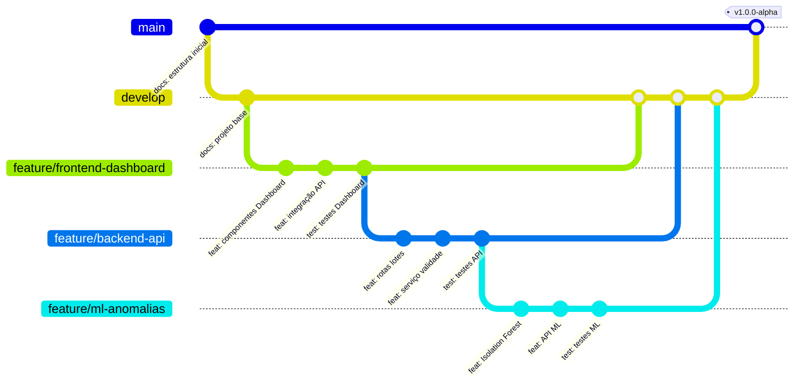

# Estrutura do Projeto e Organização do Repositório

**UC11:** Gerir Projetos de Tecnologia da Informação  
**Equipe:** William, Alaide, Ed

---

## Estrutura de Diretórios

```
atacadao-mvp/
├── .github/
│   └── workflows/
│       ├── frontend-ci.yml              # CI do frontend (lint, build)
│       ├── backend-ci.yml               # CI do backend (lint, test)
│       └── ml-ci.yml                    # CI do ML (lint, test)
│
├── docs/                                # Documentação do projeto
│   ├── README.md                        # Visão geral do projeto
│   ├── ARCHITECTURE.md                  # Decisões arquiteturais
│   ├── API.md                           # Documentação da API (Swagger/OpenAPI)
│   └── database/
│       ├── schema.sql                   # DDL completo do banco
│       ├── seeds.sql                    # Dados de exemplo
│       └── migrations/                  # Migrations versionadas
│           ├── 001_criar_tabelas_iniciais.sql
│           ├── 002_adicionar_indices.sql
│           └── 003_views_dashboard.sql
│
├── frontend/                            # Aplicação React + TypeScript
│   ├── public/
│   │   ├── index.html
│   │   ├── favicon.ico
│   │   └── manifest.json
│   ├── src/
│   │   ├── components/
│   │   │   ├── Dashboard/
│   │   │   │   ├── Dashboard.tsx
│   │   │   │   ├── Dashboard.test.tsx
│   │   │   │   ├── CardsResumo.tsx
│   │   │   │   ├── HeatmapRisco.tsx
│   │   │   │   ├── PainelAlertas.tsx
│   │   │   │   └── RankingPerdas.tsx
│   │   │   ├── LoteDetail/
│   │   │   │   ├── LoteDetail.tsx
│   │   │   │   ├── InfoLote.tsx
│   │   │   │   └── AcoesSugeridas.tsx
│   │   │   ├── Anomalias/
│   │   │   │   ├── Anomalias.tsx
│   │   │   │   ├── ListaAnomalias.tsx
│   │   │   │   └── GraficoDistribuicao.tsx
│   │   │   ├── Relatorio/
│   │   │   │   ├── RelatorioMensal.tsx
│   │   │   │   └── GraficoPerdaFilial.tsx
│   │   │   ├── Layout/
│   │   │   │   ├── Header.tsx
│   │   │   │   ├── Sidebar.tsx
│   │   │   │   └── Footer.tsx
│   │   │   └── Common/
│   │   │       ├── Loading.tsx
│   │   │       ├── ErrorBoundary.tsx
│   │   │       ├── Modal.tsx
│   │   │       └── Button.tsx
│   │   ├── hooks/
│   │   │   ├── useAuth.ts
│   │   │   ├── useWebSocket.ts
│   │   │   ├── useLotes.ts
│   │   │   └── useAnomalias.ts
│   │   ├── services/
│   │   │   ├── api.ts                    # Cliente HTTP (axios)
│   │   │   ├── auth.ts                   # Serviço de autenticação
│   │   │   ├── lotes.ts                  # Serviço de lotes
│   │   │   ├── anomalias.ts             # Serviço de anomalias
│   │   │   └── websocket.ts             # Conexão WebSocket
│   │   ├── types/
│   │   │   ├── index.ts                  # Tipos globais
│   │   │   ├── lote.ts
│   │   │   ├── anomalia.ts
│   │   │   └── usuario.ts
│   │   ├── utils/
│   │   │   ├── formatadores.ts
│   │   │   └── validadores.ts
│   │   ├── App.tsx
│   │   ├── App.css
│   │   ├── Router.tsx                    # Rotas da aplicação
│   │   └── main.tsx
│   ├── .env.example
│   ├── package.json
│   ├── tsconfig.json
│   ├── vite.config.ts
│   └── Dockerfile
│
├── backend/                             # API Node.js + Express
│   ├── src/
│   │   ├── config/
│   │   │   ├── database.js              # Conexão PostgreSQL
│   │   │   ├── redis.js                 # Conexão Redis
│   │   │   └── auth.js                  # Configuração JWT
│   │   ├── routes/
│   │   │   ├── auth.routes.js
│   │   │   ├── lotes.routes.js
│   │   │   ├── anomalias.routes.js
│   │   │   ├── relatorios.routes.js
│   │   │   └── usuarios.routes.js
│   │   ├── controllers/
│   │   │   ├── auth.controller.js
│   │   │   ├── lotes.controller.js
│   │   │   ├── anomalias.controller.js
│   │   │   ├── relatorios.controller.js
│   │   │   └── usuarios.controller.js
│   │   ├── services/
│   │   │   ├── validadeService.js       # Cálculo de risco
│   │   │   ├── anomaliaService.js       # Detecção de anomalias
│   │   │   ├── descontoService.js       # Desconto dinâmico
│   │   │   ├── notificacaoService.js    # WebSocket
│   │   │   └── totvsIntegration.js      # Integração ERP TOTVS
│   │   ├── models/
│   │   │   ├── Filial.js
│   │   │   ├── Produto.js
│   │   │   ├── Lote.js
│   │   │   ├── Perda.js
│   │   │   ├── Anomalia.js
│   │   │   ├── Alerta.js
│   │   │   └── Usuario.js
│   │   ├── middleware/
│   │   │   ├── auth.middleware.js        # Verificação JWT
│   │   │   ├── validation.middleware.js  # Validação de entrada
│   │   │   └── error.middleware.js       # Tratamento de erros
│   │   ├── sockets/
│   │   │   └── alerta.socket.js         # Eventos WebSocket
│   │   ├── utils/
│   │   │   ├── logger.js
│   │   │   └── helpers.js
│   │   └── server.js                    # Configuração do servidor
│   ├── tests/
│   │   ├── unit/
│   │   │   ├── validadeService.test.js
│   │   │   └── anomaliaService.test.js
│   │   └── integration/
│   │       ├── lotes.test.js
│   │       └── anomalias.test.js
│   ├── .env.example
│   ├── package.json
│   ├── Dockerfile
│   └── .eslintrc.js
│
├── ml/                                  # Serviço de Machine Learning (Python)
│   ├── src/
│   │   ├── app.py                       # API Flask
│   │   ├── models/
│   │   │   ├── isolation_forest.py      # Detecção de anomalias
│   │   │   └── classificador_causa.py   # Classificação de causa
│   │   ├── services/
│   │   │   ├── preprocess.py            # Pré-processamento de dados
│   │   │   ├── validade.py              # Cálculo de risco de validade
│   │   │   └── predict.py               # Inferência do modelo
│   │   └── utils/
│   │       ├── database.py              # Conexão PostgreSQL
│   │       └── metrics.py               # Métricas de avaliação
│   ├── notebooks/
│   │   ├── exploracao_dados.ipynb       # EDA inicial
│   │   └── treinamento_modelo.ipynb     # Treinamento e validação
│   ├── models/
│   │   ├── isolation_forest.pkl          # Modelo treinado
│   │   └── classificador.pkl            # Modelo treinado
│   ├── data/
│   │   ├── sample/                      # Amostras para teste
│   │   └── processed/                   # Dados processados
│   ├── tests/
│   │   ├── test_preprocess.py
│   │   └── test_models.py
│   ├── requirements.txt
│   ├── Dockerfile
│   └── .env.example
│
├── database/                            # Scripts de banco de dados
│   ├── init.sql                         # Script de inicialização
│   ├── migrations/
│   │   ├── V1__criar_tabelas.sql
│   │   ├── V2__popular_dados.sql
│   │   └── V3__criar_views.sql
│   └── rollback/
│       └── V1__rollback.sql
│
├── docker-compose.yml                   # Orquestração dos containers
├── docker-compose.dev.yml               # Ambiente de desenvolvimento
├── .env.example                         # Variáveis de ambiente
├── .gitignore
├── .editorconfig
├── README.md
└── ARCHITECTURE.md
```

---

## Organização do Repositório GitHub

### Estratégia de Branches



### Convenção de Branches

| Branch | Origem | Descrição | Quem mantém |
|--------|--------|-----------|-------------|
| `main` | — | Branch de produção. Código estável e revisado | Ed (DevOps) |
| `develop` | `main` | Integração de funcionalidades em desenvolvimento | Ed (DevOps) |
| `feature/*` | `develop` | Novas funcionalidades (ex: `feature/dashboard`) | Todos |
| `fix/*` | `develop` | Correção de bugs | Todos |
| `docs/*` | `develop` | Atualizações de documentação | Alaide |
| `release/*` | `develop` | Preparação de release | Ed (DevOps) |
| `hotfix/*` | `main` | Correção urgente em produção | Ed (DevOps) |

### Convenção de Commits

Seguindo **Conventional Commits**:

```
tipo(escopo): descrição em português (PT-BR)

tipos: feat, fix, docs, test, refactor, style, chore
escopo: frontend, backend, ml, database, docs

Exemplos:
- feat(frontend): adicionar componente de heatmap
- fix(backend): corrigir cálculo de risco de vencimento
- docs: adicionar diagrama de arquitetura
- test(ml): adicionar testes para Isolation Forest
```

### Direitos de Commit por Integrante

| Integrante | Papel | Direitos | Pastas de responsabilidade |
|------------|-------|----------|---------------------------|
| **William** | Front-end e Banco de Dados | Cria e revisa PRs de `frontend/` e `database/` | `frontend/`, `database/` |
| **Alaide** | Documentação | Cria e revisa PRs de `docs/` | `docs/`, `*.md` |
| **Ed** | Back-end e DevOps | Cria e revisa PRs de `backend/`, `ml/`, `docker-compose.yml`. Administra branches `main`, `develop` | `backend/`, `ml/`, `.github/`, `docker-compose*` |

### Fluxo de Trabalho (Git Flow)

1. Criar branch `feature/*` a partir de `develop`
2. Desenvolver a funcionalidade com commits atômicos
3. Abrir Pull Request para `develop`
4. Revisão por pelo menos 1 integrante (ou auto-revisão em equipe pequena)
5. Merge para `develop` após aprovação
6. Ao final da sprint, merge de `develop` para `main` com tag de versão

### Arquivos Obrigatórios na Raiz

| Arquivo | Descrição |
|---------|-----------|
| `README.md` | Visão geral do projeto, tecnologia, setup, equipe |
| `.gitignore` | Ignorar `node_modules/`, `__pycache__/`, `.env`, `*.pkl` |
| `.editorconfig` | Configuração consistente de editores |
| `docker-compose.yml` | Orquestração de serviços |
| `.env.example` | Template de variáveis de ambiente |

### .gitignore (sugerido)

```
# Node
node_modules/
dist/
build/

# Python
__pycache__/
*.pyc
*.pyo
venv/
.pytest_cache/

# ML
*.pkl
ml/data/processed/

# IDE
.vscode/
.idea/

# Ambiente
.env
.env.local

# SO
.DS_Store
Thumbs.db

# Documentação (não comitar)
AGENTS.md
```
