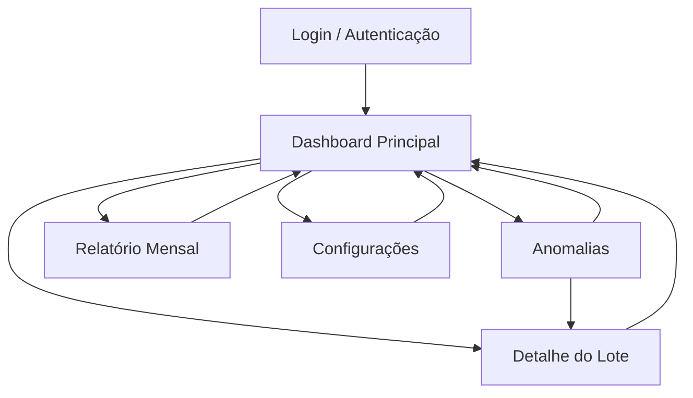
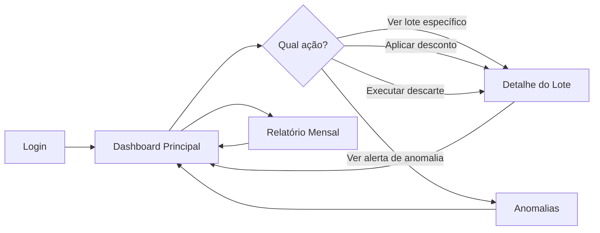
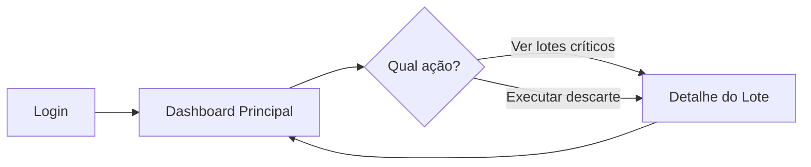
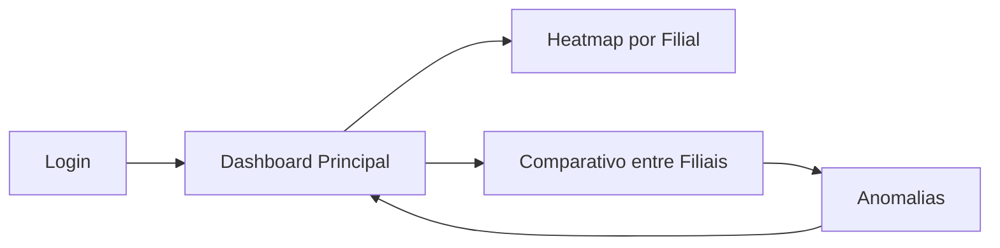
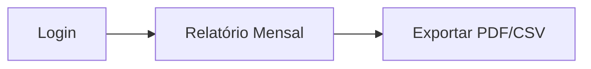

# Fluxo de Navegação — MVP Dashboard

**UC11:** Gerir Projetos de Tecnologia da Informação  
**Equipe:** William, Alaide, Ed

---

## Sitemap



---

## Fluxo por Ator

### Gerente de Loja



1. Faz login no sistema
2. Visualiza dashboard com cards de resumo, heatmap e alertas
3. Clica em um lote para ver detalhes e ações sugeridas (desconto, realocação, descarte)
4. Clica em alerta de anomalia para investigar
5. Acessa relatório mensal para ver indicadores consolidados

### Operador de Estoque



1. Faz login no sistema
2. Visualiza dashboard com foco nos lotes classificados por risco
3. Clica em lote vermelho/crítico para ver detalhes
4. Executa ações de descarte quando notificado

### Gerente Regional



1. Faz login no sistema
2. Visualiza heatmap comparativo entre filiais
3. Acessa anomalias para investigar desvios
4. Gera relatórios comparativos

### Diretoria / Auditor



1. Faz login no sistema
2. Acessa diretamente relatório mensal consolidado
3. Exporta em PDF ou CSV para análise

---

## Mapa de Telas

| Tela | Descrição | Elementos Principais | Ações Disponíveis |
|------|-----------|---------------------|-------------------|
| **Login** | Autenticação do usuário | Email, senha, botão entrar | Login |
| **Dashboard Principal** | Visão geral do sistema | Cards de resumo, heatmap, alertas, ranking | Navegar para detalhes, anomalias, relatório |
| **Detalhe do Lote** | Informações detalhadas do lote | Dados do lote, indicador de risco, ações sugeridas, timeline | Aplicar desconto, realocar, descartar, voltar |
| **Anomalias** | Lista de anomalias detectadas | Lista de anomalias, filtros, gráfico de distribuição | Investigar, descartar alerta, ver histórico |
| **Relatório Mensal** | Relatório consolidado do mês | Indicadores de meta, gráfico por filial, resumo de ações | Exportar PDF, exportar CSV |
| **Configurações** | Preferências do usuário | Perfil, notificações, loja padrão | Salvar configurações |

---

## Fluxo de Navegação Detalhado

### Caminho 1: Monitoramento de Risco
```
Login → Dashboard → Card "Lotes Vermelhos" → Detalhe do Lote → Aplicar Ação → Dashboard
```

### Caminho 2: Investigação de Anomalia
```
Login → Dashboard → Alerta Recente → Anomalias → Filtrar por Filial → Investigar → Dashboard
```

### Caminho 3: Relatório Gerencial
```
Login → Dashboard → Menu "Relatório Mensal" → Visualizar Indicadores → Exportar PDF → Dashboard
```

### Caminho 4: Ação de Descarte
```
Login → Dashboard → Notificação Push → Detalhe do Lote → Executar Descarte → Dashboard
```
