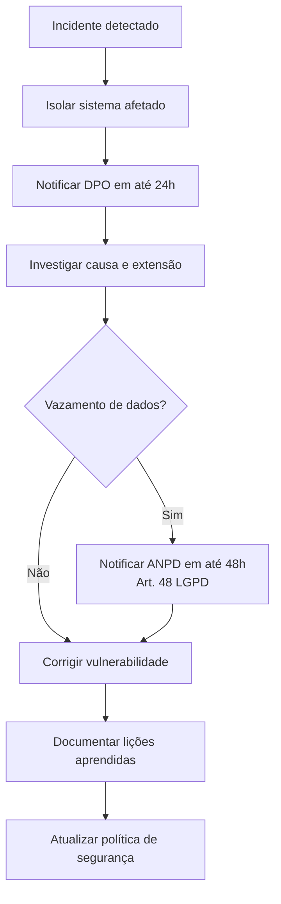

# LGPD e Conformidade — MVP

**UC11:** Gerir Projetos de Tecnologia da Informação  
**Equipe:** William, Alaide, Ed

---

## Dados Pessoais Tratados

| Tipo de Dado | Finalidade | Base Legal (LGPD) |
|-------------|-----------|-------------------|
| Nome do operador | Registro de perdas e auditoria | Art. 7º, II (cumprimento obrigação legal) |
| Filial e turno do operador | Detecção de anomalias e padrões | Art. 7º, VI (interesse legítimo) |
| Histórico de ações do operador | Trilha de auditoria | Art. 7º, II (cumprimento obrigação legal) |

## Medidas de Proteção

### Técnicas
- **Criptografia em trânsito:** TLS 1.3 entre frontend, API e banco
- **Criptografia em repouso:** AES-256 para dados sensíveis no PostgreSQL
- **Anonimização:** dados de operadores são anonimizados para treinamento do modelo ML
- **Controle de acesso:** RBAC (Admin, Gerente, Operador, Auditor)
- **Logs de auditoria:** todas as operações de leitura/escrita em dados sensíveis são registradas

### Organizacionais
- **POLÍTICA DE RETENÇÃO:** logs de auditoria mantidos por 5 anos (conforme legislação); dados de operador anonimizados após 12 meses
- **RELATÓRIO DE IMPACTO (RIPD):** recomendado antes do início do tratamento de dados pessoais
- **DPO:** designar encarregado pelo tratamento de dados (Lei 13.709/2018, Art. 41)

## Direitos dos Titulares

O sistema deve implementar mecanismos para atender aos direitos previstos no Art. 18 da LGPD:

| Direito | Implementação |
|---------|--------------|
| Confirmação e acesso | Painel "Meus Dados" para operador visualizar seus registros |
| Correção | Formulário para solicitar correção de dados incorretos |
| Exclusão | Botão de solicitação de anonimização (retenção legal respeitada) |
| Portabilidade | Exportação dos dados do operador em formato CSV |

## Fluxo de Resposta a Incidentes

## Checklist de Conformidade

- [ ] DPO designado
- [ ] RIPD realizado
- [ ] Consentimento dos operadores (quando aplicável)
- [ ] Política de retenção documentada
- [ ] Procedimento de resposta a incidentes
- [ ] Criptografia TLS 1.3 habilitada
- [ ] Controle de acesso RBAC implementado
- [ ] Logs de auditoria ativos
- [ ] Canais de exercício de direitos do titular
