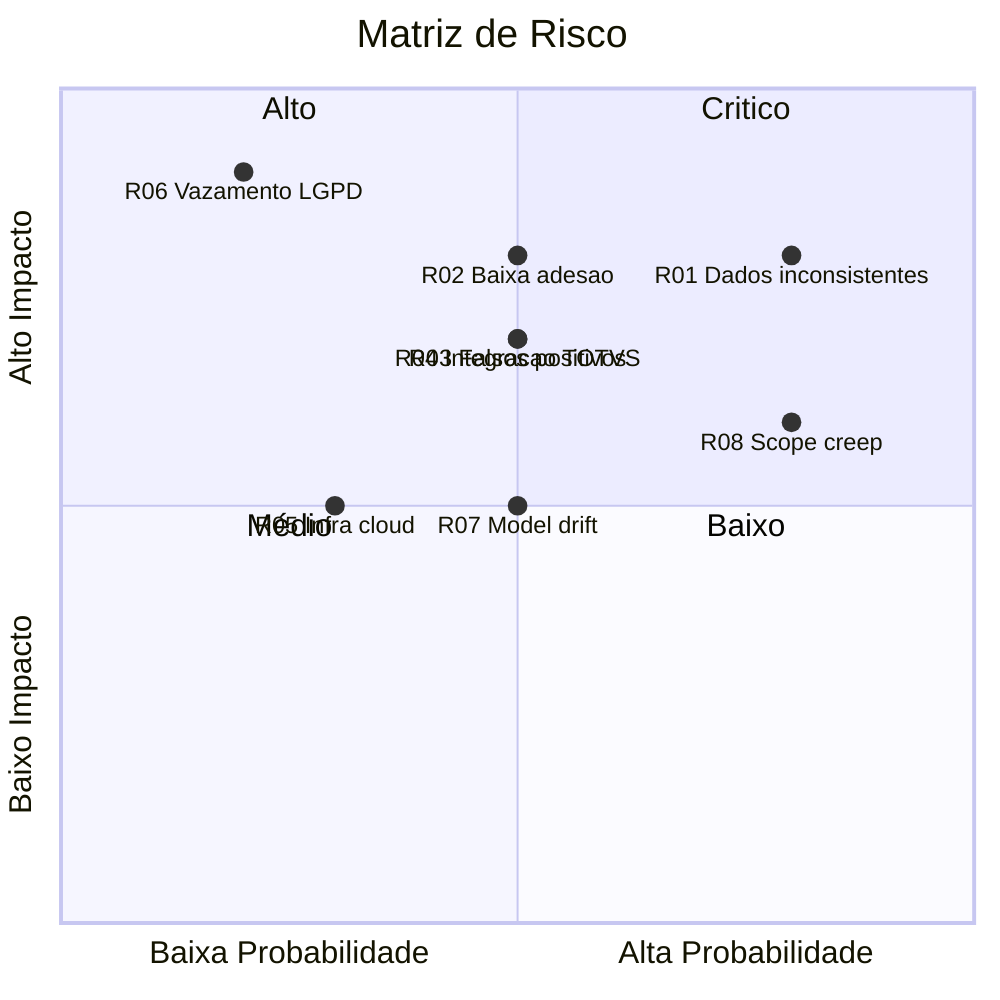

# Riscos e Mitigação — MVP

**UC11:** Gerir Projetos de Tecnologia da Informação  
**Equipe:** William, Alaide, Ed

---

| ID | Risco | Probabilidade | Impacto | Estratégia de Mitigação |
|----|-------|:------------:|:-------:|--------------------------|
| R01 | Dados do ERP inconsistentes ou desatualizados | Alta | Alto | Criar validações de integridade na ingestão; dashboards com indicador de confiança dos dados |
| R02 | Baixa adesão dos gerentes ao sistema | Média | Alto | Envolver usuários-chave no design (UX); treinamento presencial; gamificação (ranking de lojas) |
| R03 | Falsos positivos gerarem desconfiança no ML | Média | Alto | Manter taxa de FP < 10%; permitir que usuário marque alerta como "falso positivo" para retroalimentar o modelo |
| R04 | Dificuldade de integração com ERP legado (TOTVS) | Média | Alto | Contar com equipe de TI do Atacadão; criar camada de abstração (adapters) para facilitar manutenção |
| R05 | Falta de infraestrutura cloud para ML | Baixa | Médio | Usar serviços gerenciados (AWS SageMaker / Google Vertex) para escalar apenas quando necessário |
| R06 | Vazamento de dados (LGPD) | Baixa | Crítico | Anonimizar dados de operadores; criptografar em trânsito e repouso; controle de acesso por papel |
| R07 | Modelo ML degradar ao longo do tempo (drift) | Média | Médio | Monitorar métricas do modelo continuamente; retreinar trimestralmente com novos dados |
| R08 | Escopo crescer além do MVP (scope creep) | Alta | Alto | Definir critérios de aceitação claros; usar backlog para registrar ideias pós-MVP |

## Matriz de Risco

## Planos de Contingência

| Risco | Gatilho | Ação de Contingência |
|-------|---------|----------------------|
| R01 | > 20% dos registros com dados inválidos | Parar ingestão; notificar TI; usar dados mockados para testes |
| R02 | < 30% de adoção após 1 mês do piloto | Entrevistar usuários; redesenhar UX; criar incentivos |
| R06 | Identificação de vazamento | Isolar sistema imediatamente; notificar DPO; seguir plano de resposta a incidentes LGPD |
