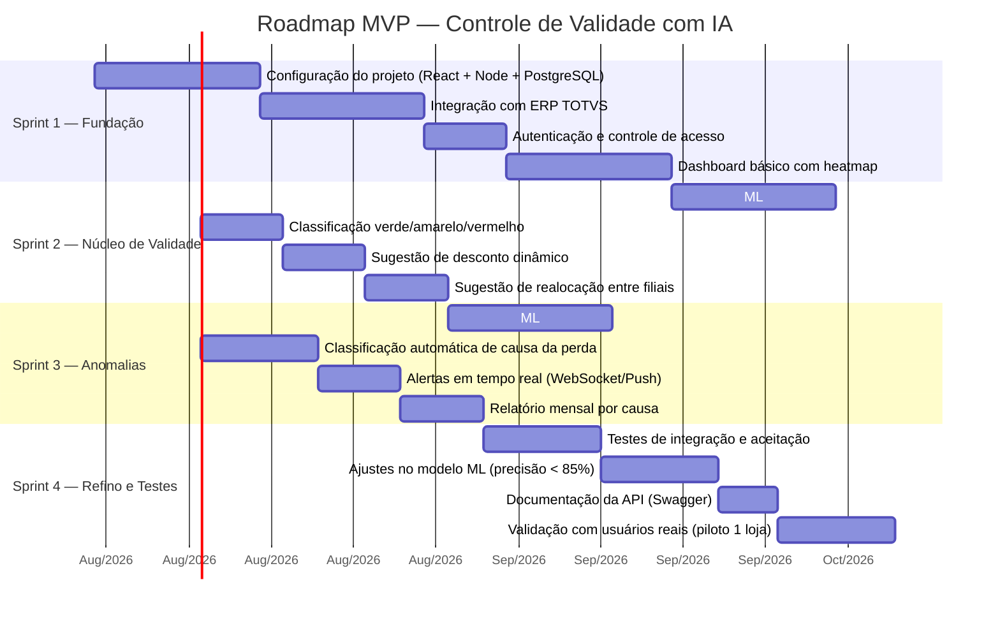

# Roadmap / Sprints — MVP

**UC11:** Gerir Projetos de Tecnologia da Informação  
**Equipe:** William, Alaide, Ed

---

## Detalhamento das Sprints

### Sprint 1 — Fundação (30 dias)
- Setup do ambiente (React + TypeScript, Node.js API, PostgreSQL)
- Conector para ler dados do TOTVS (lotes, validades, vendas)
- Tela de login com SSO
- Dashboard com heatmap (mockado)

### Sprint 2 — Núcleo de Validade (35 dias)
- Modelo ML que cruza data de vencimento com velocidade média de venda
- Indicadores verde/amarelo/vermelho no dashboard
- Módulo de sugestão: desconto automático
- Módulo de sugestão: realocação entre filiais

### Sprint 3 — Anomalias (38 dias)
- Modelo Isolation Forest para detecção de anomalias
- Classificador automático de causa raiz
- Sistema de notificações push
- Relatório mensal consolidado

### Sprint 4 — Refino e Testes (35 dias)
- Testes E2E, integração e aceitação
- Otimização do modelo ML
- Documentação da API
- Piloto em 1 loja por 2 semanas

## Release Plan

| Release | Conteúdo | Entrega |
|---------|----------|---------|
| v1.0.0 (MVP) | Monitoramento de validade + sugestões + anomalias | Final Sprint 4 |
| v1.1.0 | Dashboard avançado com drill-down | Pós-MVP |
| v1.2.0 | Painel de auditoria para MP | Pós-MVP |
